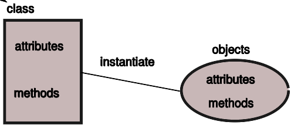

INF-1400 - Objektorientert Programmering
=========================================


Course Staff
--------------

**Lectures**

* John Markus Bjørndalen
* Henrik Hillestad Løvold
* Rune Bostad

**TA**

| TA                          | Group | Time      |
|-----------------------------|-------|-----------|
| Håvard Livastøl             | 1     | Man 14-16 |
| Sindre Sagelv Bjørvik       | 2     | Fre 14-16 |
| Johan Niillas Jernsletten   | 3     | Ons 14-16 |
| Sivert Steinholt            | 4     | Tor 10-12 |
| Børge Bårdsen               | 5     | Tor 14-16 |
| Fredrik Hagen Fasteraune    | 6     | Tor 14-16 |
| Rafael Nozal Cañadas (stip) | 7     | Ons 10-12 |


Topics
-------

* Korona information
* About the course
* Practical things
* Introduction to Object-Oriented Programming


Korona information
-------------------

See [this info](https://github.com/uit-inf-1400-2022/uit-inf-1400-2022.github.io/blob/main/korona.md). 

More information about using Github for the course further down. 


Course Description - INF-1400
------------------------------


**Innhold**
Emnet gir en innføring i objektorientert programmering. 
Dette inkluderer en innføring i sentrale begreper som innkapsling, klasser, arv, og polymorfi. Metoder, grensesnitt, og samspill mellom objekter er også sentralt i emnet.

[Emneside](http://uit.no/studiekatalog/emner/2022/var/inf-1400-1)

Textbook
--------

Python Object Oriented Programming - Fourth Edition, Steven F. Lott, Dusty Phillips
[PDF-versjon](https://www.packtpub.com/product/python-object-oriented-programming-fourth-edition/9781801077262)

(Some) Python advantages
------------------------

* High level programming language, also useful for scripting
* Described as "executable pseudo code"
* Readable (and often short!) code
* Plenty of libraries
* Interpreted

One of Python's drawbacks

* Intepreted (slow, but not always)


PyGame
------

Used for the mandatory exercises. Based on SDL.
[pygame.org](https://www.pygame.org)

Mandatory exercises
--------------------

* Breakout / Arkanoid (game)
* Boids (simulation of flocking birds)
* Mayhem / XPilot (game)

Canvas
-------

* Make sure you have access to the canvas board for the course
  - You should get access after registering for the course
* If you've done the assignments previously, please contact your TA

GitHub
------

Course material is provided through GitHub
* [Link to course repository](https://github.com/uit-inf-1400-2022/uit-inf-1400-2022.github.io)
* Can be used as a normal web page from a browser, no log-in required
* Contains a full snapshot of the course materials
* Version history

<!-- 
TODO: May not be working now: 
You can use the [RSS URL](https://github.com/uit-inf-1400-2022/uit-inf-1400-2022.github.io/commits/master.atom) in your own RSS reader if you prefer.
-->

Git - the super-easy crash course
----------------------------------
For those that want a fully updated copy of the course material without using a browser; use Git.

Initial checkout (get access to current files):

```
git clone git@github.com:uit-inf-1400-2022/uit-inf-1400-2022.github.io.git
```

If you don't have a GitHub account, use HTTPS:
```
git clone https://github.com/uit-inf-1400-2022/uit-inf-1400-2022.github.io
```

Updating your copy:

```
# cd somewhere inside the course folder, then:
git pull
```

We will talk more about git soon. It's _very_ useful for group projects.

Other messages
---------------
* Tutorials start next week in the group sessions. 
* First mandatory assignment will be handed out next week. 


Quick OO-introduction: lists
-----------------------------
* List abstraction from inf-1100: a data structure and a set of functions
* Want to provide multiple list types:
  * General list implementation
  * Optimized for adding items at the end
  * Optimized for accessing the nth item
  * A sorted list that stays sorted when it is modified
* Need multiple data structures and a set of functions for each data structure


Given a list pointer, which `list_add()` function do we call?

```c
list_add_last(list, item);
sorted_list_add(list, item);
append_list_add(list, item);
```

One solution is to test for list type everywhere you use a list

```c
if (list->type == LIST_TYPE_DEFAULT)
    list_add_last(list, item);
else if (list->type == LIST_TYPE_SORTED)
    sorted_list_add(list, item);
else if (list->type == LIST_TYPE_APPEND)
    append_list_add(list, item);
```

Need to locate all if-tests when adding a new list type.


OO-solution: add the functions (methods) to the objects.

```c++
// C++ class
class List {
    ListNode *head;
    int numItems;
    ...
    int add(void *item) { return addLast(item); }
    int addLast(void *item);
};

int List::addLast(void *item)
{
...
```

Basic idea:

* The object has a known interface
* Lets the user/programmer handle objects without caring about the implementation (for instance how data is stored and managed)
* Can use multiple implementations (types/classes) as long as they have the same interface



Instantiate: in practice similar to the allocate + initialize methods from the ADTs you made before Christmas.

Classes define how objects work (both implementation and interface) and give them an identity (as an object of that class).

Basic concepts:

* The object abstraction includes methods, or operations on the objects
* Objects are created (instantiated) based on classes. A single object is called an instance of its class.
  * Example: a string object is an instance of a String class.
* Data in a class or object is called an attribute (ex: int numItems)
* Operations (functions) in a class are called methods.
* Signature: parameters and return value of a method.

Next part
---------

* More on objects
* Introduction to Python
